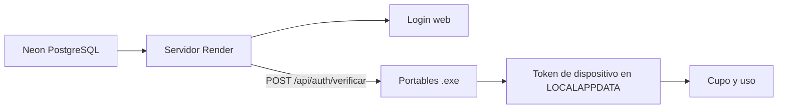

# Usuarios en la nube (portable + online)

Este documento describe cómo centralizar el listado de usuarios **fuera del repositorio Git**, para que vos lo actualices una sola vez y todas las instalaciones (portables y servidor web) tomen los cambios.

## ¿El compilado (.exe) está enlazado a Neon?

**No automáticamente.** El portable habla con Render. Los usuarios viven en Neon.

| Modo | Configuración | Origen de usuarios |
|------|---------------|-------------------|
| **Producción (portable)** | Nada junto al `.exe`. URL embebida → `POST /api/auth/verificar` | PostgreSQL **Neon** vía Render |
| **Desarrollo local** | `auth_users.json` / `.enc` en la raíz del repo | Archivo de prueba (no commitear) |

La caché y el token de dispositivo van a `%LOCALAPPDATA%\DepuracionExcelComprobantes` (cifrados), no a la carpeta del `.exe`.

**No incluyas** en la carpeta del portable: `auth_users.json`, `auth_users.enc`, `auth_remote.enc`, `auth_remote.txt`.

## Idea general



- En **Render + Neon**, los usuarios viven en la base (`usuarios_registrados`); ver `docs/AUTH_DATABASE_NEON.md`.
- Los **portables** autentican con **`POST /api/auth/verificar`** (usuario + contraseña). No leen Neon directo.
- **No commitear** `auth_users.json` ni `auth_users.enc` con claves reales.

## Formato del JSON

Ejemplo con administrador, vencimiento y metadatos:

```json
{
  "version": 1,
  "updated_at": "2026-06-08T15:30:00+00:00",
  "users": {
    "Lucas": {
      "password": "CAMBIAR_POR_UN_SECRETO_UNICO",
      "rol": "admin",
      "valido_hasta": "2027-06-08"
    },
    "juan": {
      "password": "CAMBIAR_POR_OTRO_SECRETO",
      "email": "juan@example.com",
      "valido_desde": "2026-01-01",
      "valido_hasta": "2027-06-08",
      "activo": true
    }
  }
}
```

- **`rol": "admin"`** — usuario administrador (Lucas). También acepta `"es_admin": true`.
- Usuario con `"activo": false` **no puede ingresar**.
- **`valido_desde`** / **`valido_hasta`**: fechas inclusive (`YYYY-MM-DD` o `DD/MM/YYYY`).
- El campo `email` es informativo (preparado para futuras altas).

## Configuración en Render (gratis)

En el dashboard de Render → **Environment** (como *Secret*):

```env
# Preferido: Neon (DATABASE_URL) + AUTH_ADMIN_USER / AUTH_ADMIN_PASSWORD de respaldo.
# AUTH_USERS_JSON es legacy; si existe, usá placeholders (nunca contraseñas reales).
AUTH_USERS_REMOTE_TOKEN=un-token-largo-y-secreto
AUTH_ADMIN_USER=Lucas
AUTH_CUPO_REQUIRE_DEVICE=1
```

Los usuarios viven en Neon. No exportes el directorio completo a portables: `/api/auth-users` responde **410** salvo escape `AUTH_EXPORT_AUTH_USERS=1`.

**Portables (2026.8.3+)** — no llevan `auth_remote.enc` ni `auth_users.enc`. La URL de Render está en el programa. El login es `POST /api/auth/verificar` (rate-limit por usuario). Tras un login OK, el token de dispositivo se guarda en AppData y se usa para cupo/uso.

Los `.enc` viejos junto al `.exe` se pueden borrar después de actualizar; el instalador no los pisa si siguen ahí.

**Token `AUTH_USERS_REMOTE_TOKEN` en Render:** opcional para portables viejos y para el escape `AUTH_EXPORT_AUTH_USERS=1`. El login nuevo no lo necesita.

**Token de dispositivo (`dev_…`):** tras login OK se emite un Bearer ligado a usuario + `device_id` de instalación. Cupo/uso **exigen** ese token. Panel admin → Altas → sección Dispositivos (revocar / renombrar).

**Entitlement firmado (Ed25519):** el mismo login puede devolver un JSON firmado de vida corta (cupo/vigencia). El portable lo guarda cifrado y, sin red, lo usa como tope confiable (no el contador local editable). Requiere `AUTH_ENTITLEMENT_PRIVATE_KEY` en Render (`python tools/generar_entitlement_keys.py`). TTL default 48 h (`AUTH_ENTITLEMENT_TTL_SEC`).

**Authenticode:** firma digital del `.exe` en Windows (SmartScreen). Ver `docs/FIRMA_AUTHENTICODE.md` y `tools/firmar_portable.ps1`.

**Rotación:** `AUTH_USERS_REMOTE_TOKEN` ya no viaja en el portable nuevo. Si un token viejo se filtró, rotarlo en Render igual deja de servir a copias 2026.8.2. Las copias nuevas no lo usan.

## Desarrollo local y build portable

1. Copiá `auth_users.example.json` → `auth_users.json` (ignorado por Git) para probar `python app.py`.
2. Al compilar: `python tools/portable_build.py` **no** copia padrón ni token de sync a `dist/…`.
3. **Orden de publicación:** push a GitHub/Render → esperar deploy → compilar portable e instalador → `aplicar_update.bat` en cada carpeta DyC.

| Variable | Uso |
|----------|-----|
| `AUTH_USERS_PATH` | Fuerza un archivo local (`.json` o `.enc`). |
| `AUTH_STORE_KEY` | Clave Fernet opcional (avanzado; por defecto usa cifrado embebido). |
| `AUTH_ADMIN_USER` / `AUTH_ADMIN_PASSWORD` | Un solo usuario de respaldo. |

## Protección en portables (cupo y licencia)

| Capa | Qué hace |
|------|-----------|
| **Stores `.enc` en AppData** | Cupo y token de dispositivo en `%LOCALAPPDATA%\DepuracionExcelComprobantes\` van cifrados. Si alguien edita el archivo, deja de servir. |
| **Servidor autoritativo** | Consulta y descuento de cupo solo vía Render/Neon. Sin red → cupo 0 (no se procesa). |
| **Sin padrón en la carpeta del .exe** | Login contra el servidor. Copiar `D:\sistemas\juan` no se lleva usuarios ni el Bearer global. |

**Importante:** el cifrado embebido impide cambios casuales (Bloc de notas), pero **no** es DRM absoluto: un atacante avanzado podría extraer la clave del `.exe`. La defensa comercial fuerte es el **servidor + Neon** como fuente de verdad del cupo.

Para forzar cifrado también en desarrollo: `AUTH_STORE_ENCRYPT=1`.

## Protección mínima

1. Solo **HTTPS**.
2. Token **`AUTH_USERS_REMOTE_TOKEN`** en `/api/auth-users`.
3. **Nunca** subir claves al repo Git.
4. A medio plazo: migrar contraseñas a hash (`bcrypt`).

## Flujo de trabajo (admin)

1. Entrás con **Lucas** (rol admin).
2. Para cambiar usuarios en producción: editás **`AUTH_USERS_JSON`** en Render.
3. Los portables actualizan en **≤ 2 minutos** si usan sync remoto.
4. Para dar de baja: quitás el usuario o ponés `"activo": false`.

## Diagnóstico

```python
from auth import estado_auth, load_users, es_administrador
print(estado_auth())
print(len(load_users()), "usuarios cargados")
print(es_administrador("Lucas"))
```

## Próximos pasos

- Panel web de administración (solo usuario con `rol: admin`).
- Contraseñas hasheadas.
- Login con Google para usuarios finales.
