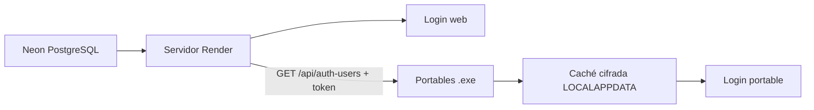

# Usuarios en la nube (portable + online)

Este documento describe cómo centralizar el listado de usuarios **fuera del repositorio Git**, para que vos lo actualices una sola vez y todas las instalaciones (portables y servidor web) tomen los cambios.

## ¿El compilado (.exe) está enlazado a Neon?

**No automáticamente.** Hay dos formas de usuarios en el portable:

| Modo | Configuración | Origen de usuarios |
|------|---------------|-------------------|
| **Recomendado (Neon vía web)** | `auth_remote.txt` junto al `.exe` con URL `https://analisisdelcontribuyente.onrender.com/api/auth-users` y el token Bearer | PostgreSQL **Neon** (altas aprobadas + admin), exportadas por la web en Render |
| **Local cifrado** | `auth_users.enc` junto al `.exe` (sin JSON en claro) | Archivo generado al compilar o con `python tools/encrypt_auth_users.py` |

La caché remota en `%LOCALAPPDATA%` se guarda **cifrada** (`auth_users_cache.enc`).

**No incluyas** en la carpeta del portable: `auth_users.json`, `auth_users.example.json` (solo plantilla de desarrollo en el repo).

## Idea general



- En **Render + Neon**, los usuarios viven en la base (`usuarios_registrados`); ver `docs/AUTH_DATABASE_NEON.md`.
- Los **portables** sincronizan desde **`GET /api/auth-users`** (no leen Neon directo).
- **No commitear** `auth_users.json` ni `auth_users.enc` con claves reales.

## Formato del JSON

Ejemplo con administrador, vencimiento y metadatos:

```json
{
  "version": 1,
  "updated_at": "2026-06-08T15:30:00+00:00",
  "users": {
    "Lucas": {
      "password": "Lucas1992.",
      "rol": "admin",
      "valido_hasta": "2027-06-08"
    },
    "juan": {
      "password": "clave-segura-2",
      "email": "juan@gmail.com",
      "valido_desde": "2026-01-01",
      "valido_hasta": "2027-06-08",
      "activo": true
    }
  }
}
```

- **`rol": "admin"`** — usuario administrador (Lucas). También acepta `"es_admin": true`.
- Usuario con `"activo": false` **no puede ingresar**.
- **`valido_desde`** / **`valido_hasta`**: fechas inclusive (`YYYY-MM-DD` o `DD/MM/YYYY`).
- El campo `email` es informativo (preparado para futuras altas).

## Configuración en Render (gratis)

En el dashboard de Render → **Environment** (como *Secret*):

```env
AUTH_USERS_JSON={"version":1,"users":{"Lucas":{"password":"Lucas1992.","rol":"admin","valido_hasta":"2027-06-08"},"prueba":{"password":"prueba","valido_hasta":"2026-06-30"}}}
AUTH_USERS_REMOTE_TOKEN=un-token-largo-y-secreto
AUTH_ADMIN_USER=Lucas
```

Para editar usuarios: modificás `AUTH_USERS_JSON` en el dashboard y guardás (Render redeploya solo).

**Portables** — archivo `auth_remote.txt` junto al `.exe`:

```text
https://analisisdelcontribuyente.onrender.com/api/auth-users
un-token-largo-y-secreto
```

O en `.env` local:

```env
AUTH_USERS_URL=https://analisisdelcontribuyente.onrender.com/api/auth-users
AUTH_USERS_REMOTE_TOKEN=un-token-largo-y-secreto
AUTH_USERS_REFRESH_SEC=120
```

**Importante (portable):** si existen **`auth_remote.txt`** y **`auth_users.enc`** juntos, el `.enc` **no se ignora**. El admin local del `.enc` (p. ej. Lucas generado con `setup_auth_portable.bat`) **siempre puede ingresar**, aunque falle la sync remota (sin token, sin internet o Render dormido). Los clientes de Neon se suman vía sync cuando hay token e internet; las claves del `.enc` prevalecen sobre el remoto para el mismo usuario.

**Token en `auth_remote.txt`:** es un secreto de cliente embebido en la carpeta del `.exe`. Impide que terceros descarguen `/api/auth-users` sin el portable, pero **no** protege contra quien ya tiene la carpeta (copia del dist, USB, etc.). No commitear; rotar en Render si se expone. Alternativa más cerrada: solo `auth_users.enc` sin sync remota (sin clientes Neon automáticos).

## Desarrollo local y build portable

1. Copiá `auth_users.example.json` → `auth_users.json` (ignorado por Git).
2. Editá usuarios para probar en `python app.py`.
3. Al compilar: `python tools/portable_build.py` genera **`auth_users.enc`** en `dist/…` (cifrado).  
   O manualmente: `python tools/encrypt_auth_users.py`.

| Variable | Uso |
|----------|-----|
| `AUTH_USERS_PATH` | Fuerza un archivo local (`.json` o `.enc`). |
| `AUTH_STORE_KEY` | Clave Fernet opcional (avanzado; por defecto usa cifrado embebido). |
| `AUTH_ADMIN_USER` / `AUTH_ADMIN_PASSWORD` | Un solo usuario de respaldo. |

## Protección mínima

1. Solo **HTTPS**.
2. Token **`AUTH_USERS_REMOTE_TOKEN`** en `/api/auth-users`.
3. **Nunca** subir claves al repo Git.
4. A medio plazo: migrar contraseñas a hash (`bcrypt`).

## Flujo de trabajo (admin)

1. Entrás con **Lucas** (rol admin).
2. Para cambiar usuarios en producción: editás **`AUTH_USERS_JSON`** en Render.
3. Los portables actualizan en **≤ 2 minutos** si usan sync remoto.
4. Para dar de baja: quitás el usuario o ponés `"activo": false`.

## Diagnóstico

```python
from auth import estado_auth, load_users, es_administrador
print(estado_auth())
print(len(load_users()), "usuarios cargados")
print(es_administrador("Lucas"))
```

## Próximos pasos

- Panel web de administración (solo usuario con `rol: admin`).
- Contraseñas hasheadas.
- Login con Google para usuarios finales.
